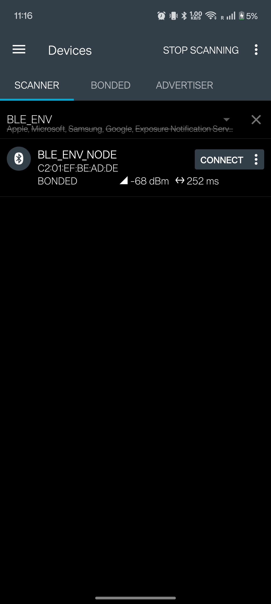
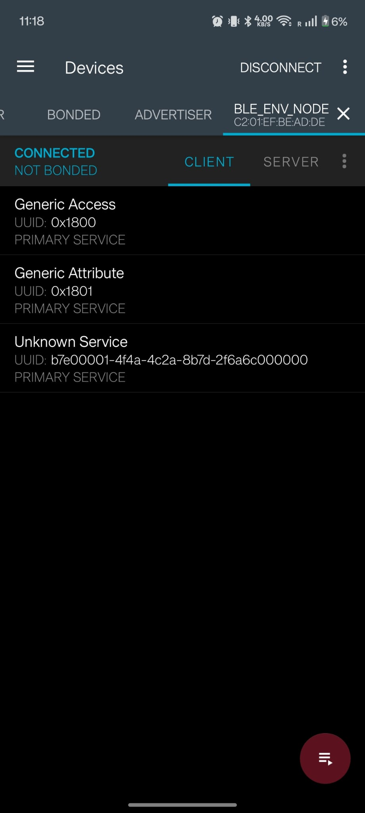
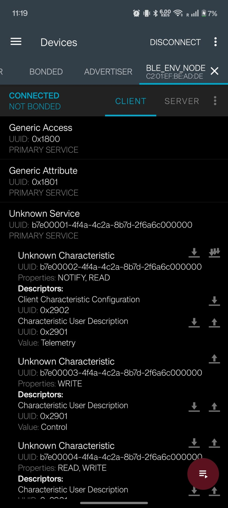
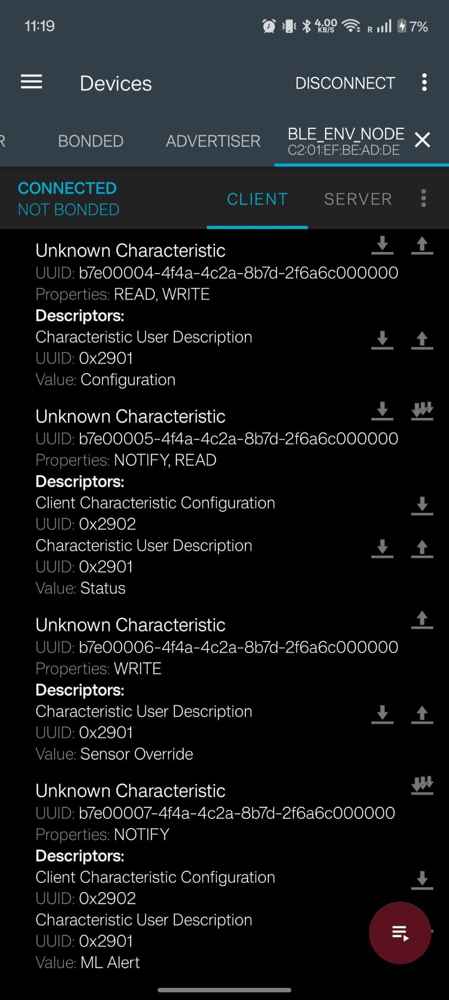
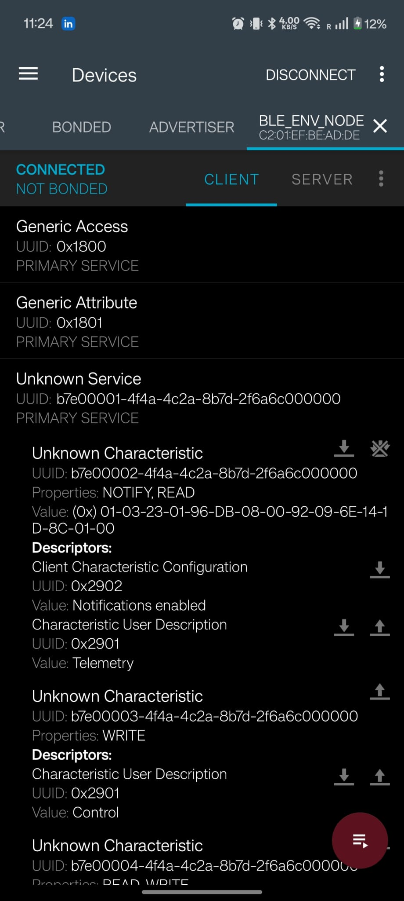
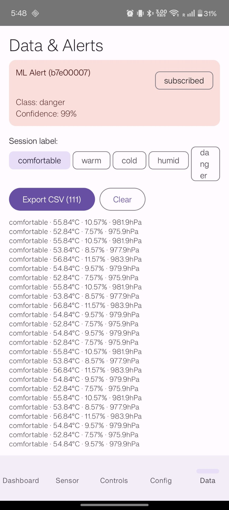
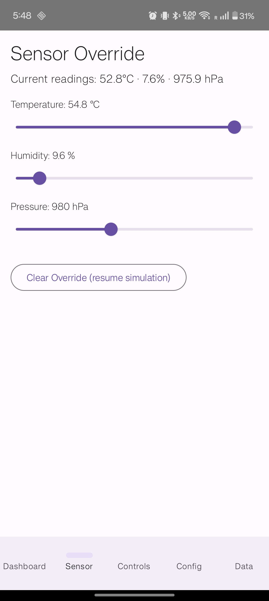

# BLE Environmental Sensor Node

A fully working BLE peripheral on ESP32-C3 with **simulated and override-injectable environmental telemetry**, a custom GATT profile, a 0.42" SSD1306 OLED display, on-device TinyML classification, and a Kotlin/Jetpack Compose Android companion app.

> **Sensor status:** The current firmware uses a built-in simulation (with realistic ±2°C drift) and a Sensor Override characteristic that lets you inject real sensor readings from the Android app without wiring additional hardware. The `env_sensor` component is architected for a drop-in BME280/SHT31 swap — see [Hardware Notes](#hardware-notes) and [Roadmap](#roadmap).

Built spec-first: frozen GATT UUIDs, phase-by-phase implementation plan, on-target Unity tests, and a 19-case manual test matrix — all documented so the project can be understood, built, or extended without prior context.

---

## Quick Start

```bash
# 1. Source ESP-IDF (required before every idf.py command)
source ~/esp/esp-idf/export.sh

# 2. Set target (once per checkout)
cd firmware
idf.py set-target esp32c3

# 3. Build
idf.py build

# 4. Flash and monitor (adjust port as needed — /dev/ttyUSB0 or /dev/ttyACM0)
idf.py -p /dev/ttyACM0 flash monitor

# 5. Build Android app (requires Android Studio or JDK 17+)
cd android/BleEnvNode
./gradlew assembleDebug
./gradlew installDebug   # requires USB-connected Android phone with debugging enabled
```

Full details in `docs/build_and_flash.md`.

---

## Target Platform

- **MCU:** ESP32-C3 (RISC-V single-core, 160 MHz)
- **SDK:** ESP-IDF v5.2.3 + NimBLE BLE host stack
- **Display:** 0.42" SSD1306 OLED on I2C (SDA=GPIO5, SCL=GPIO6, addr 0x3C, 72×40 visible)
- **Android app:** Kotlin 1.9 + Jetpack Compose BOM 2024.04, min SDK 26 (Android 8.0)

---

## Hardware Notes

**MCU choice:** The ESP32-C3 was used because it was available and familiar, not because it is the optimal choice for a BLE peripheral. A production-grade device would use the nRF52840 or nRF5340 — purpose-built for BLE with a dedicated radio co-processor, ARM TrustZone security, and significantly lower current draw in sleep. The ESP32-C3 runs at 160 MHz with an active current of ~80 mA, which is high for a coin-cell or battery-constrained application. For a prototype or connected-home device running on USB power, this is fine. See `docs/power_budget.md` for the full analysis.

**Sensor status:** The firmware uses a simulated sensor (with realistic drift) because the physical BME280 was not available during development. The architecture is fully ready for a real sensor — the `env_sensor` component has a swap point, and the `SIM` badge on the OLED and in telemetry flags clears automatically once real data is present.

**Using Sensor Override as a real-sensor stand-in:** If you have a real temperature/humidity/pressure sensor but want to inject readings without wiring it to the ESP32, use the Android companion app's Sensor Override screen. Write actual sensor readings to characteristic `b7e00006` (Sensor Override) via the sliders — the firmware accepts them immediately, clears the `SIM` badge, and uses those values for TinyML classification and telemetry. Writing all-zeros restores the built-in simulation. This means the full firmware stack (TinyML, GATT, OLED, Android app) can be validated with real environmental data without any additional hardware.

---

## Core Features

**Firmware (Phases 0–9):**
- BLE advertising with custom Environmental Service UUID
- GATT v2 — 6 named characteristics with User Description (0x2901) descriptors
- Simulated telemetry with time-based drift (temp/humidity/pressure)
- Notification-based telemetry at configurable interval (500ms–60s, default 2s)
- LED, display, and power mode control via BLE writes
- Persistent configuration through NVS (survives reboot)
- MITM Passkey Display pairing + bonding; encrypted writes for Control / Config / Sensor Override. OLED shows a 6-digit passkey on first connect; Android prompts the user to type it. Reconnects use stored bond keys silently. See [`docs/security_model.md`](docs/security_model.md) for the full SM config and bonded-reconnect behaviour.
- OLED showing rotating pages: BLE state · temperature · humidity, with `SIM` badge
- **Sensor Override** (b7e00006): inject simulated values via BLE; ±2°C drift for realism
- **TinyML** (b7e00007): on-device 5-class environmental classifier (comfortable/warm/cold/humid/danger) + anomaly detection, notifies on class change
- 245-weight pure-C MLP (3→16→8→5), no external ML runtime required
- Binary: **0x94f00 bytes (58% of 1MB flash)**

**Android App (Phase 9B):**
- BLE scan, connect, MITM Passkey pairing (Android prompts for the 6-digit passkey shown on the OLED)
- Dashboard: live telemetry + bond/encryption status
- Sensor: override sliders (temp/humidity/pressure) with persistent state
- Controls: LED / display / power mode / force-sample commands
- Config: report interval slider + boot flags
- Data & Alerts: ML Alert subscription, class + confidence, labeled history, CSV export

---

## Screenshots

### nRF Connect — GATT Service
| Scan | Services | Characteristics (top) | Characteristics (bottom) |
|---|---|---|---|
|  |  |  |  |

### nRF Connect — Telemetry
| Telemetry read + notifications enabled |
|---|
|  |

### Android Companion App
| Dashboard | ML Alerts | Config |
|---|---|---|
|  |  |  |

| Controls | Sensor Override |
|---|---|
|  |  |

---

## Repository Map

```text
.
├── AGENT_BRIEF.md
├── CLAUDE.md                          # auto-loaded per-session agent guidance
├── CONTRIBUTING.md
├── LICENSE                            # MIT
├── README.md
├── SECURITY.md
├── docs/
│   ├── architecture.md                # system layers, module map, event flows
│   ├── build_and_flash.md             # full toolchain setup
│   ├── debug_guide.md                 # symptom → diagnosis reference
│   ├── design_decisions.md            # DD-001 to DD-019 with rationale
│   ├── gatt_profile.md                # FROZEN v2 — 6 characteristics, byte layouts
│   ├── implementation_plan.md         # phase-by-phase with exit criteria
│   ├── learning/
│   │   ├── resources.md               # curated reading list + code inspiration sources
│   │   ├── tinyml_guide.md            # ML/TinyML from first principles
│   │   └── android_ble_guide.md       # Android BLE + Compose from first principles
│   ├── power_budget.md
│   ├── requirements.md                # FR-001 to FR-015
│   ├── screenshots/                   # nRF Connect + Android app screenshots
│   ├── security_model.md
│   ├── test_plan.md
│   ├── ble_packet_capture_notes.md    # HCI snoop log methodology + packet reference
│   └── RELEASE_NOTES_v1_0_0.md       # v1.0.0 features, limitations, test summary
├── firmware/
│   ├── main/app_main.c                # entry point + telemetry_task
│   └── components/
│       ├── app_core/                  # state machine, NVS config, app_config.h
│       ├── ble_env/                   # NimBLE GATT service (6 characteristics)
│       ├── env_sensor/                # sensor provider + BLE override + drift
│       ├── display/                   # SSD1306 driver + page rotator
│       └── tinyml_inference/          # pure-C MLP + anomaly detection
├── android/BleEnvNode/                # Kotlin/Compose companion app
├── ml/                                # Python ML training pipeline
│   ├── collect_synthetic.py           # generate 1500-sample synthetic baseline
│   ├── train_classifier.py            # 5-class MLP (98.83% on synthetic test set — box-separability, not real-sensor skill; see RELEASE_NOTES)
│   ├── quantize.py                    # int8 quantization + model_data.cc
│   └── verify_model.py                # smoke-test 5 known vectors
├── tests/manual_test_matrix.md        # TC rows with Pass/Not run status
└── tools/
    ├── decode_telemetry_frame.py
    └── gatt_uuid_reference.md
```

---

## Understanding the Project

**If you want to understand what was built:** Start with the [Quick Start](#quick-start) to get the firmware running, then `docs/architecture.md` for system design and `docs/gatt_profile.md` for the BLE API.

**If you want to extend or modify it:** Read `docs/design_decisions.md` for the 19 architectural decisions and their rationale, `docs/implementation_plan.md` for the phase structure, and `CONTRIBUTING.md` for development guidelines.

**If you want to validate it:** See `tests/manual_test_matrix.md` (19 test cases, all passing) and `docs/test_plan.md` for the full test strategy.

**If you are an AI coding agent:** Read `AGENT_BRIEF.md` and `CLAUDE.md` first — these define the per-phase workflow, approval gates, and scope constraints.

**Learning resources:**
- `docs/learning/tinyml_guide.md` — ML concepts and TinyML on embedded from first principles
- `docs/learning/android_ble_guide.md` — Android BLE API and Jetpack Compose from first principles

---

## Build Status

| Component | Status | Details |
|-----------|--------|---------|
| Firmware | ✅ Green | 0x94f00 bytes (58% flash) — ESP32-C3 / ESP-IDF v5.2.3 |
| Android app | ✅ Green | `./gradlew assembleDebug` — min SDK 26 |
| ML model | ✅ Trained | 98.83% on the synthetic test set (1500 synthetic + 379 override samples drawn from the same disjoint class boxes used to train — measures box-separability, not real-sensor skill). Real-sensor accuracy unknown until retrained on BME280/SHT31 readings. |
| Unit tests | ✅ Build pass | 8 env_sensor tests + ble_env encode tests |
| Manual tests | ✅ Pass | TC-001–TC-012, TC-D01–TC-D04, TC-SEC-01–TC-SEC-04 — all 20 pass (2026-05-29) |

---

## Building with an AI Agent

This repo is structured so an AI coding agent (Claude Code or similar) can implement it phase by phase without prior context:

- `AGENT_BRIEF.md` — non-negotiable constraints and build order
- `CLAUDE.md` — per-session workflow, approval gate, multi-agent orchestration rules
- `docs/implementation_plan.md` — phases with explicit exit criteria
- Edits to existing source files require explicit user approval; new files may be added freely

**Scope-containment preamble for sub-agents (copy into agent prompts):**
> You may only write to files inside the repository root. You may READ from `~/esp/esp-idf/` for ESP-IDF headers and examples, but never write there. Do not touch any other path. Do not invoke `gh`, `git push`, `git remote add`, `idf.py flash`, or `idf.py monitor` — those are reserved for the human operator.

---

## Roadmap

**Next milestone — v1.2.0: Real sensor integration**
- Wire BME280 or SHT31 to I2C (SDA=GPIO5, SCL=GPIO6)
- Implement `sensor_provider_bme280.c` behind the existing `sensor_provider.h` interface — no GATT or Android app changes needed
- The `SIM` badge on the OLED and in telemetry flags (`BLE_ENV_FLAG_SIMULATED_DATA`) clears automatically once real data flows
- Retrain the TinyML classifier on real-sensor data to replace the synthetic training set

**Further out**
- Secure OTA firmware update
- Battery Service (0x180F) and Device Information Service (0x180A)
- Numeric-comparison pairing (BLE_HS_IO_DISPLAY_YES_NO) as an alternative to the current Passkey Display flow
- nRF52840 port for significantly lower power consumption

---

## Definition of Done

The project is complete when:
- Device advertises as `BLE_ENV_NODE`; nRF Connect shows CONNECTED + BONDED
- All 6 GATT v2 characteristics visible with User Description names
- Telemetry readable and notifying at configured interval
- LED/control/display/power commands accepted via BLE
- Sensor override (b7e00006) changes telemetry values; all-zeros restores simulation
- ML Alert (b7e00007) notifies on class change with correct class + confidence
- Configuration survives reboot (NVS)
- OLED shows three rotating pages with `SIM` badge
- Android app connects, pairs, shows live telemetry, and exports labeled CSV
- TinyML classifies all 5 classes correctly; anomaly fires on uncertain inputs
- All Unity unit tests build and pass on-target
- README contains build/flash/test instructions and screenshots ✓
