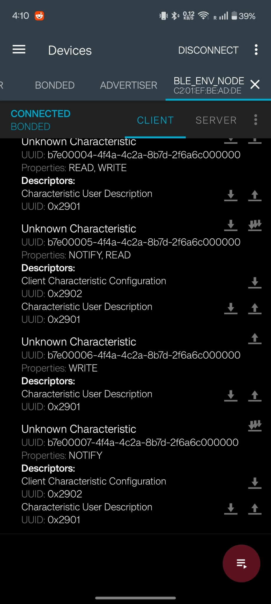
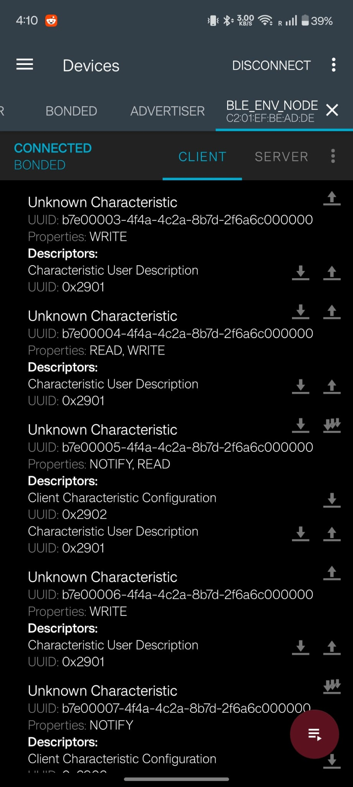
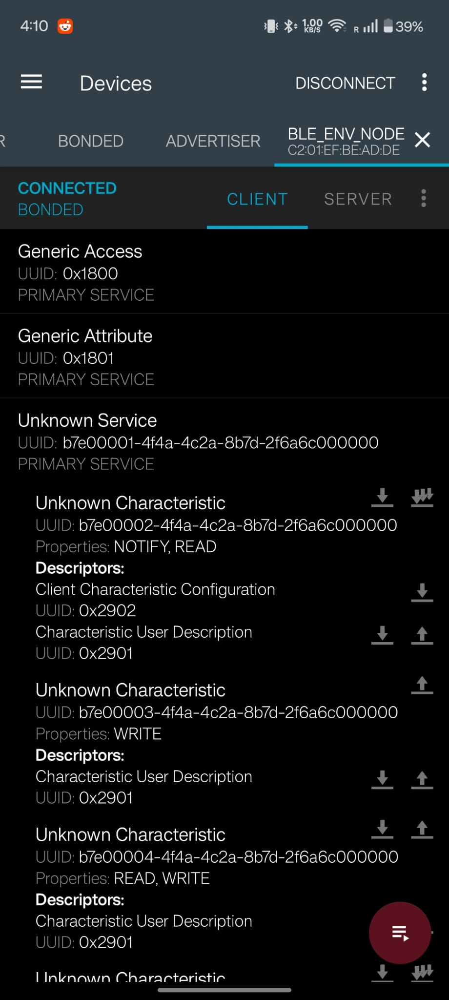
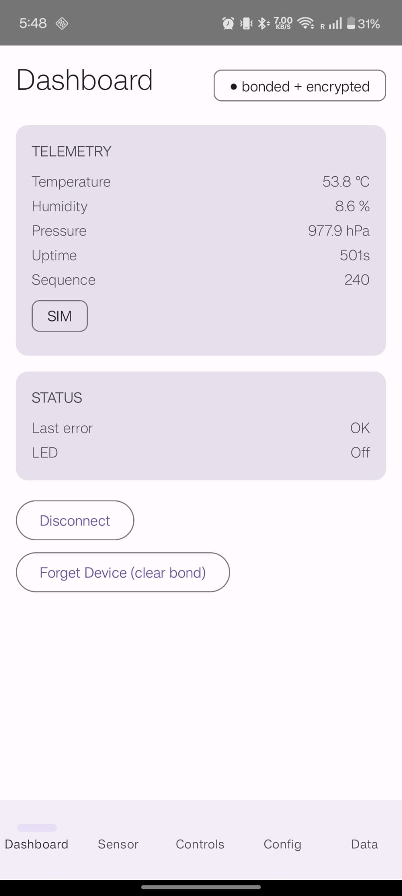
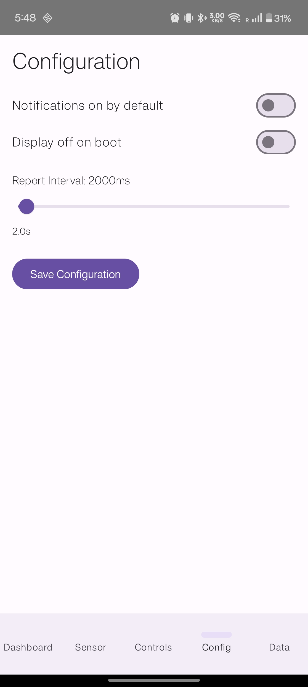
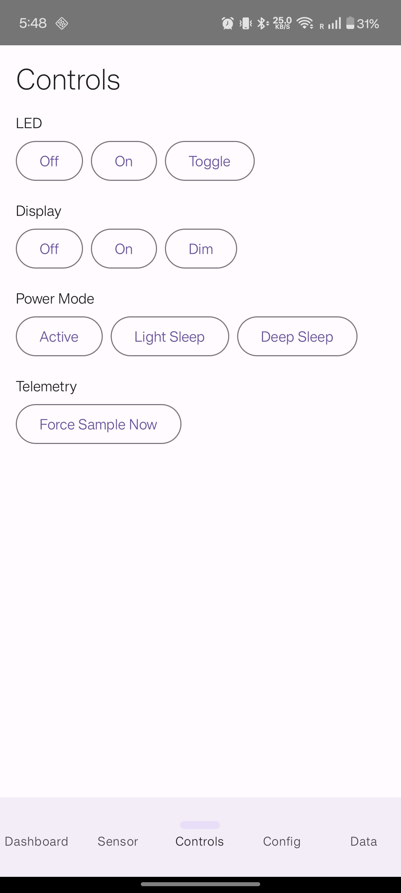

# BLE Environmental Sensor Node — Spec-Driven Embedded Project

## Purpose

This repository is a complete, self-contained BLE learning project for an embedded engineer. It is written so that either a human developer or an autonomous coding agent can understand what to build without prior conversation context.

The device is a Bluetooth Low Energy peripheral on ESP32-C3 that exposes environmental telemetry and device control over a custom GATT profile, drives a 0.42" SSD1306 OLED, runs on-device TinyML environmental classification, and pairs with a Kotlin/Jetpack Compose Android companion app.

Repository: <https://github.com/karangandhi-projects/ble-environmental-sensor-node> (private).

---

## Quick Start

```bash
# 1. Source ESP-IDF (required before every idf.py command)
source ~/esp/esp-idf/export.sh

# 2. Set target (once per checkout)
cd firmware
idf.py set-target esp32c3

# 3. Build
idf.py build

# 4. Flash and monitor (adjust port as needed — /dev/ttyUSB0 or /dev/ttyACM0)
idf.py -p /dev/ttyACM0 flash monitor

# 5. Build Android app (requires Android Studio or JDK 17+)
cd android/BleEnvNode
./gradlew assembleDebug
./gradlew installDebug   # requires USB-connected Android phone with debugging enabled
```

Full details in `docs/build_and_flash.md`.

---

## Target Platform

- **MCU:** ESP32-C3
- **SDK:** ESP-IDF v5.2.3 + NimBLE BLE host stack
- **Display:** 0.42" SSD1306 OLED on I2C (SDA=GPIO5, SCL=GPIO6, addr 0x3C, 72×40 visible)
- **Android app:** Kotlin 1.9 + Jetpack Compose BOM 2024.04, min SDK 26 (Android 8.0)

---

## Core Features

**Firmware (Phases 0–9):**
- BLE advertising with custom Environmental Service UUID
- GATT v2 — 6 named characteristics with User Description (0x2901) descriptors
- Simulated telemetry with time-based drift (temp/humidity/pressure)
- Notification-based telemetry at configurable interval (500ms–60s, default 2s)
- LED, display, and power mode control via BLE writes
- Persistent configuration through NVS (survives reboot)
- Just Works BLE pairing + bonding; encrypted writes for Control/Config/Sensor Override
- OLED showing rotating pages: BLE state · temperature · humidity, with `SIM` badge
- **Sensor Override** (b7e00006): inject simulated values via BLE; ±2°C drift for realism
- **TinyML** (b7e00007): on-device 5-class environmental classifier (comfortable/warm/cold/humid/danger) + anomaly detection, notifies on class change
- 245-weight pure-C MLP (3→16→8→5), no external ML runtime required
- Binary: **0x99520 bytes (59% of 1MB flash)**

**Android App (Phase 9B):**
- BLE scan, connect, Just Works pairing
- Dashboard: live telemetry + bond/encryption status
- Sensor: override sliders (temp/humidity/pressure) with persistent state
- Controls: LED / display / power mode / force-sample commands
- Config: report interval slider + boot flags
- Data & Alerts: ML Alert subscription, class + confidence, labeled history, CSV export

---

## Screenshots

### nRF Connect — GATT Service
| Service overview | Characteristics (1–4) | Characteristics (5–7) |
|---|---|---|
|  |  |  |

### Android Companion App
| Dashboard | Data & Alerts | Config |
|---|---|---|
|  |  |  |

| Controls | Sensor Override |
|---|---|
|  |  |

---

## Repository Map

```text
.
├── AGENT_BRIEF.md
├── CLAUDE.md                          # auto-loaded per-session agent guidance
├── README.md
├── docs/
│   ├── architecture.md                # system layers, module map, event flows
│   ├── build_and_flash.md             # full toolchain setup
│   ├── debug_guide.md                 # symptom → diagnosis reference
│   ├── design_decisions.md            # DD-001 to DD-019 with rationale
│   ├── gatt_profile.md                # FROZEN v2 — 6 characteristics, byte layouts
│   ├── implementation_plan.md         # phase-by-phase with exit criteria
│   ├── learning/
│   │   ├── tinyml_guide.md            # ML/TinyML from first principles
│   │   └── android_ble_guide.md       # Android BLE + Compose from first principles
│   ├── power_budget.md
│   ├── requirements.md                # FR-001 to FR-015
│   ├── screenshots/                   # nRF Connect + Android app screenshots
│   ├── security_model.md
│   └── test_plan.md
├── firmware/
│   ├── main/app_main.c                # entry point + telemetry_task
│   └── components/
│       ├── app_core/                  # state machine, NVS config, app_config.h
│       ├── ble_env/                   # NimBLE GATT service (6 characteristics)
│       ├── env_sensor/                # sensor provider + BLE override + drift
│       ├── display/                   # SSD1306 driver + page rotator
│       └── tinyml_inference/          # pure-C MLP + anomaly detection
├── android/BleEnvNode/                # Kotlin/Compose companion app
├── ml/                                # Python ML training pipeline
│   ├── collect_synthetic.py           # generate 1500-sample synthetic baseline
│   ├── train_classifier.py            # 5-class MLP (99.7% accuracy)
│   ├── quantize.py                    # int8 quantization + model_data.cc
│   └── verify_model.py                # smoke-test 5 known vectors
├── tests/manual_test_matrix.md        # TC rows with Pass/Not run status
└── tools/
    ├── decode_telemetry_frame.py
    └── gatt_uuid_reference.md
```

---

## How to Use This Package

1. Read `AGENT_BRIEF.md` first.
2. If you are an agent (Claude Code or similar), read `CLAUDE.md` — per-phase workflow, approval gate, scope-containment preamble.
3. Read `docs/vision.md` and `docs/requirements.md` for the target product.
4. Read `docs/gatt_profile.md` before writing any BLE code — UUIDs and byte layouts are frozen.
5. Follow `docs/implementation_plan.md` phase by phase.
6. Use `docs/test_plan.md` and `tests/manual_test_matrix.md` to validate each phase.
7. Keep `docs/design_decisions.md` updated when changing architecture.

**Learning resources:**
- `docs/learning/tinyml_guide.md` — ML concepts + TinyML on embedded from first principles
- `docs/learning/android_ble_guide.md` — Android BLE API + Jetpack Compose from first principles

---

## Build Status

| Component | Status | Details |
|-----------|--------|---------|
| Firmware | ✅ Green | 0x99520 bytes (59% flash) — ESP32-C3 / ESP-IDF v5.2.3 |
| Android app | ✅ Green | `./gradlew assembleDebug` — min SDK 26 |
| ML model | ✅ Trained | 99.7% accuracy — 1879 samples (1500 synthetic + 379 real) |
| Unit tests | ✅ Build pass | 8 env_sensor tests + ble_env encode tests |
| Manual tests | ✅ Verified | Phase 9A/9B/9C confirmed on hardware |

---

## Build with an Agent

This repo is designed to be executable by Claude Code or any spec-following agent:

- `CLAUDE.md` is auto-loaded into each session.
- `docs/implementation_plan.md` defines phases with exit criteria.
- Multi-agent orchestration is used to parallelize code-gen work; hardware-bound steps stay single-threaded.
- Sub-agents run under a scope-containment preamble — writes confined to this repository.
- Edits to existing source files require explicit user approval; new files may be added freely.

**Scope-containment preamble for sub-agents (copy verbatim into agent prompts):**
> You may only write to files inside `/home/karan-gandhi/ble_skill_project_package_reviewed/`. You may READ from `~/esp/esp-idf/` for ESP-IDF headers/examples, but never write there. Do not touch any other path. Do not invoke `gh`, `git push`, `git remote add`, `idf.py flash`, or `idf.py monitor`.

---

## Definition of Done

The project is complete when:
- Device advertises as `BLE_ENV_NODE`; nRF Connect shows CONNECTED + BONDED
- All 6 GATT v2 characteristics visible with User Description names
- Telemetry readable and notifying at configured interval
- LED/control/display/power commands accepted via BLE
- Sensor override (b7e00006) changes telemetry values; all-zeros restores simulation
- ML Alert (b7e00007) notifies on class change with correct class + confidence
- Configuration survives reboot (NVS)
- OLED shows three rotating pages with `SIM` badge
- Android app connects, pairs, shows live telemetry, and exports labeled CSV
- TinyML classifies all 5 classes correctly; anomaly fires on uncertain inputs
- All Unity unit tests build and pass on-target
- README contains build/flash/test instructions and screenshots ← **you are here**
